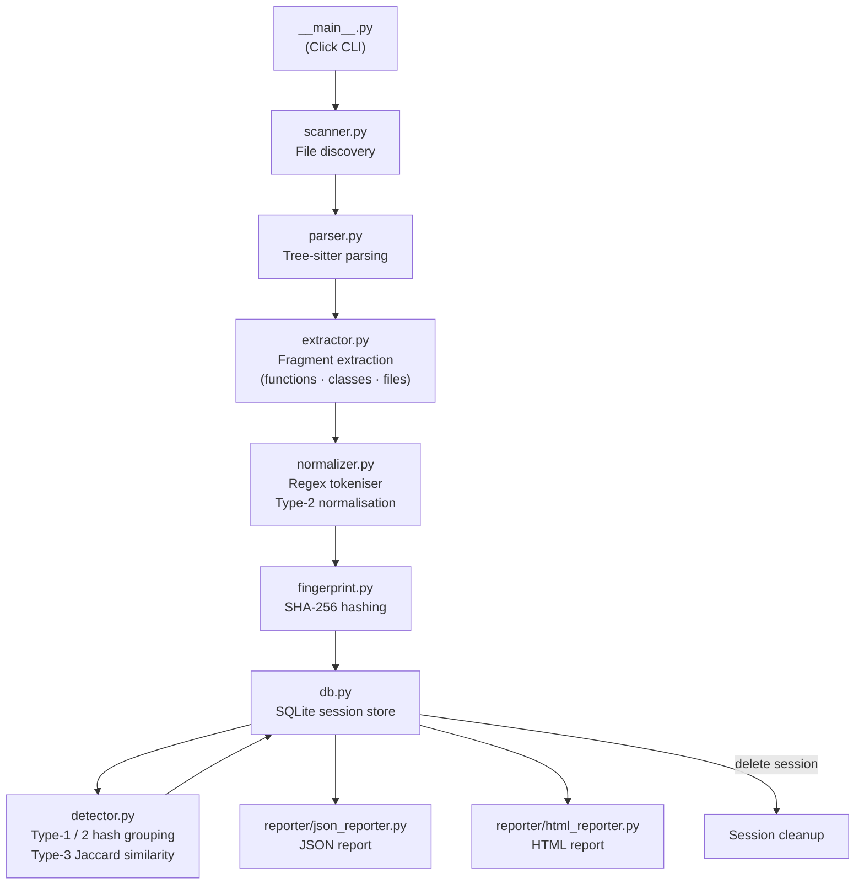

# codeecho 1.0.0

> A developer tool that scans your codebase to detect and highlight **echoes** of duplicated or near-duplicated code, so you can refactor toward cleaner, more maintainable designs.

[](LICENSE)
[](https://pypi.org/project/codeecho/)

## Prerequisites

- Python `>=3.14`

## Installation

```powershell
pip install codeecho
```

## Usage

```powershell
python -m codeecho <path> [options]
```

### Clone detection levels

| Type | Detection strategy | Example |
|------|--------------------|---------|
| **Type-1** | Exact copy-paste — identical token sequences | Two functions with the same code copied verbatim |
| **Type-2** | Structural clone — same structure, renamed identifiers / literals | Same logic with different variable names |
| **Type-3** | Near-duplicate — high Jaccard similarity on token sets | Nearly identical functions with a few extra lines |

### Supported languages

| Language | Extensions |
|----------|-----------|
| Python | `.py` |
| JavaScript | `.js`, `.mjs`, `.cjs` |
| TypeScript | `.ts`, `.tsx` |
| Java | `.java` |
| Go | `.go` |
| Gosu | `.gs`, `.gsx` |

### Arguments

| Argument | Description |
|----------|-------------|
| `path` | Root directory to scan. |

### Options

| Option | Default | Description |
|--------|---------|-------------|
| `--types <types>` | `all` | Clone types to detect: comma-separated (`1`, `2`, `3`) or `all`. |
| `--threshold <float>` | `0.8` | Jaccard similarity threshold for Type-3 detection (`0.0`–`1.0`). |
| `--output <name>` | `codeecho-output` | Base name (without extension) for output file(s). |
| `--output-dir <dir>` | `<cwd>/reports` | Directory where output file(s) will be written. |
| `--db <path>` | `<temp>/codeecho.db` | Path to the SQLite scratch database used during a scan run. Session records are removed after the report is written. |
| `--format <fmt>` | `both` | Output format: `json`, `html`, or `both`. |
| `--min-tokens <n>` | `10` | Minimum token count for a code fragment to be included. |
| `--exclude <pattern>` | _(none)_ | Glob pattern(s) to exclude from scanning (repeatable). |
| `--version` | | Print the version and exit. |
| `-h, --help` | | Show help and exit. |

### Examples

Scan the current directory and write both JSON and HTML reports:

```powershell
python -m codeecho .
```

Detect only Type-1 and Type-2 clones in a `src/` tree:

```powershell
python -m codeecho src --types 1,2
```

Scan with a custom output name and directory:

```powershell
python -m codeecho . --output my-scan --output-dir audit/reports
```

Lower the Type-3 threshold to catch more near-duplicates:

```powershell
python -m codeecho . --threshold 0.6
```

Exclude test and vendor directories:

```powershell
python -m codeecho . --exclude "*/tests/*" --exclude "*/vendor/*"
```

## Configuration

| Environment variable | Description |
|----------------------|-------------|
| `CODEECHO_CONFIG_DIR` | Directory where `logging.ini` is seeded on first run. When unset, the bundled copy inside the package is used directly. |

## Development

### Prerequisites

- Poetry `2.2+`

### Setup

```powershell
poetry install
```

### Run

```powershell
poetry run python -m codeecho <path> [options]
```

### Architecture



| Module | Responsibility |
|--------|---------------|
| `__main__.py` | Argument parsing and pipeline orchestration |
| `scanner.py` | Recursive file discovery; extension → language mapping |
| `parser.py` | Tree-sitter grammar loading; one fresh parser per file |
| `extractor.py` | Fragment extraction via Tree-sitter queries; byte-range-only node access |
| `normalizer.py` | Regex-based token extraction; identifier/literal placeholder substitution |
| `fingerprint.py` | SHA-256 over raw and normalised token sequences |
| `detector.py` | Type-1/2 hash grouping; Type-3 Jaccard + union-find clustering |
| `db.py` | `SessionDB` context manager; SQLite scratch store with cascade delete |
| `reporter/json_reporter.py` | Reads session DB; writes structured JSON report |
| `reporter/html_reporter.py` | Reads session DB; renders self-contained HTML report via Jinja2 |

### Format and Lint

```powershell
poetry run black codeecho
poetry run pylint codeecho
```

### Run Tests with Coverage

```powershell
poetry run pytest --cov=codeecho tests --cov-report html
```

## [Changelog](CHANGELOG.md)

## License

This project is licensed under the [MIT License](LICENSE).

## Author

Ron Webb
